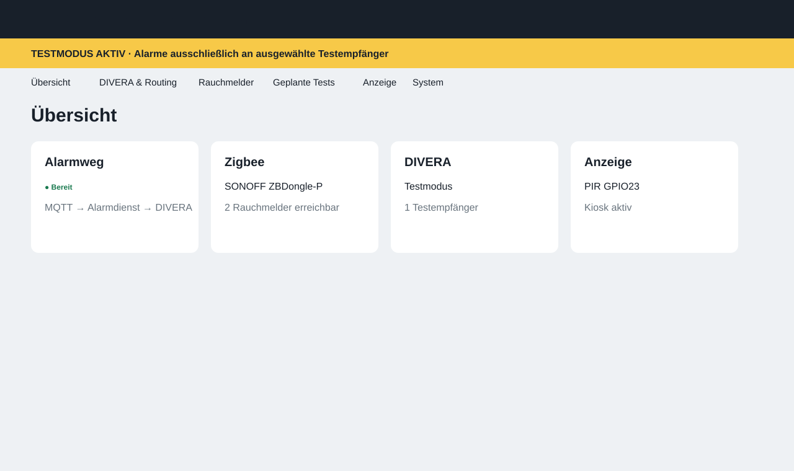
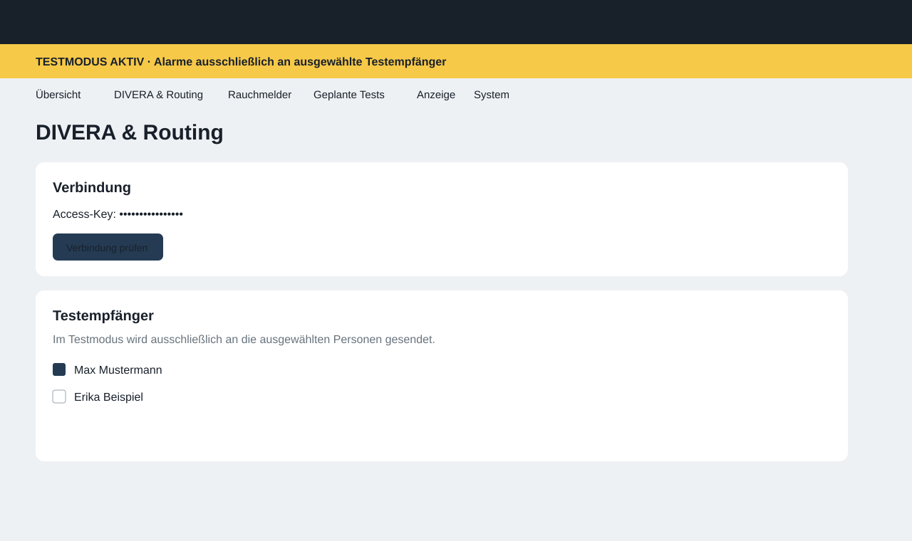
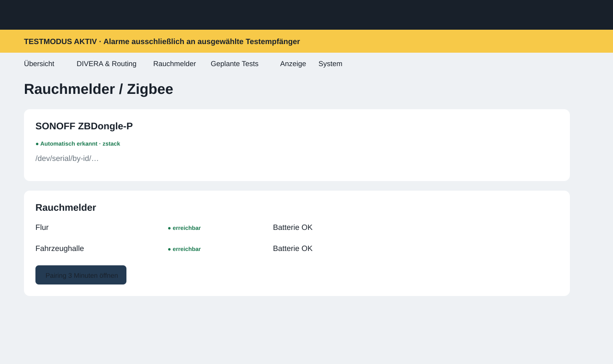
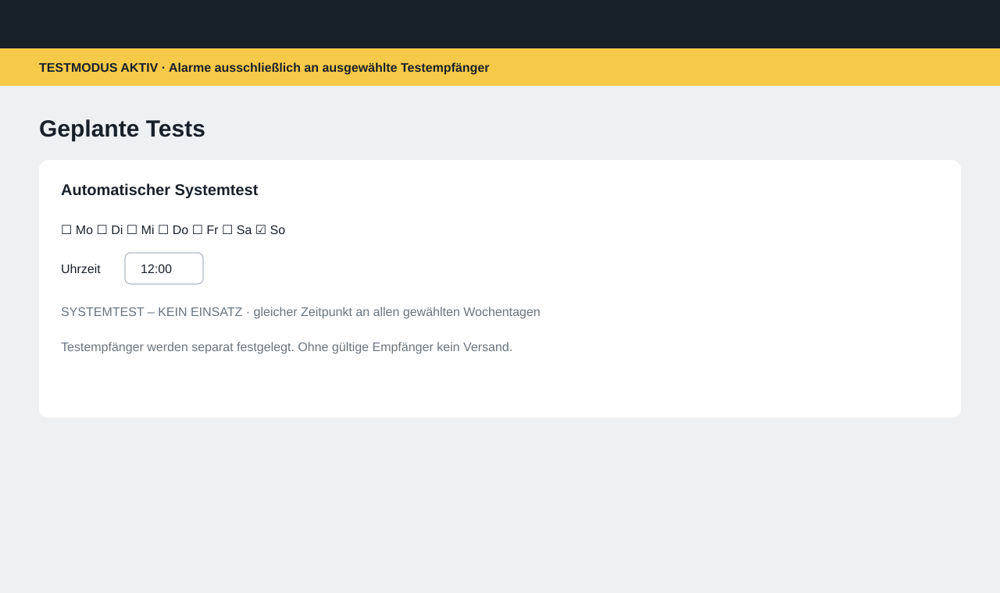

# Weboberfläche

Die Administration läuft lokal im zweiten Chromium-Kiosk-Tab. Die folgenden Bilder sind **Referenzansichten der implementierten Oberfläche**, keine unabhängigen Konzept-Mockups. Farben, Navigation, Testmodus-Banner und Informationshierarchie entsprechen dem Webserver unter `app/divera_alarm/main.py`.

## Übersicht

## DIVERA und Routing

Der Testmodus bleibt bei Erstinstallation aktiv. Ohne explizit ausgewählte Testempfänger wird kein Alarm versendet.

## Rauchmelder und Zigbee

## Geplante Tests

Der Standard ist Sonntag 12:00 Uhr. Mehrere Wochentage können gewählt werden; die Uhrzeit gilt gemeinsam und wird in 15-Minuten-Schritten angeboten.

## Weitere Bereiche

**Anzeige / Kiosk** verwaltet DIVERA-URL, Display-Leerlaufzeit und PIR-Diagnose. **System / Administration** zeigt Dienstzustände, Wiederherstellung und Diagnose. Sicherheitskritische Funktionen werden erst freigeschaltet, wenn die zugrunde liegenden privilegierten Helfer vollständig eingerichtet sind.
